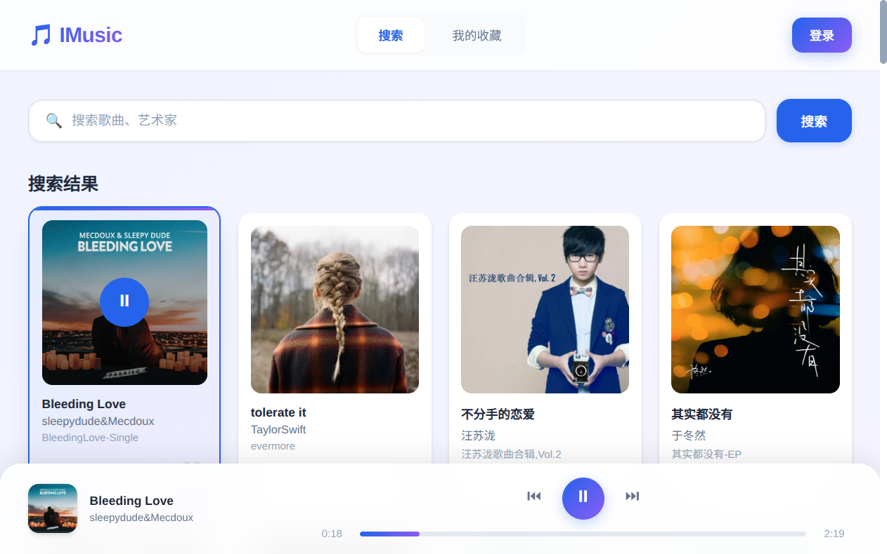
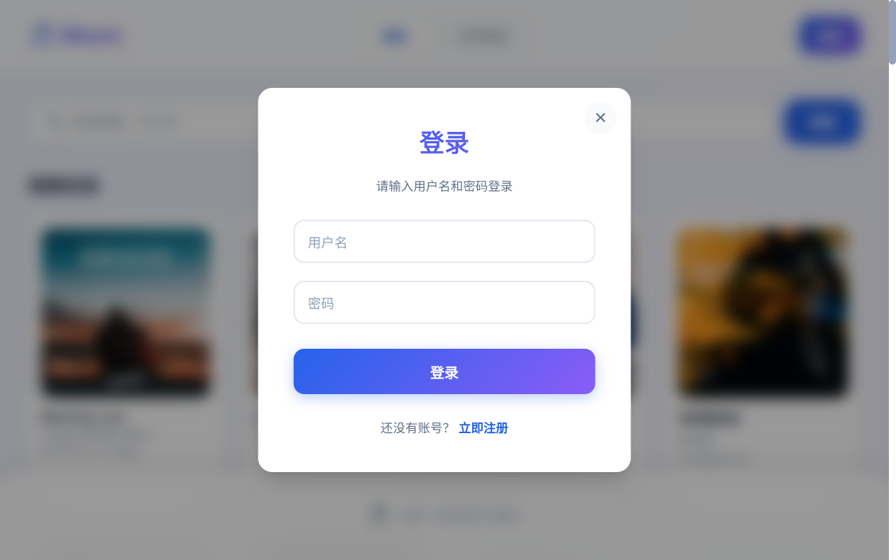
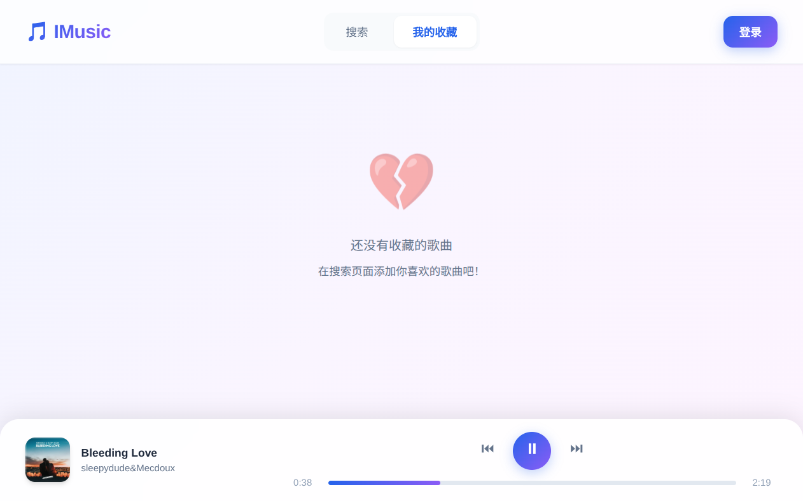

# IMusic 系统使用说明

> 本文档详细介绍 IMusic 在线音乐播放系统的部署方式、界面说明及使用方法。

---

## 目录

1. [系统环境要求](#一系统环境要求)
2. [系统部署指南](#二系统部署指南)
3. [界面概览](#三界面概览)
4. [功能使用指南](#四功能使用指南)
5. [常见问题](#五常见问题)

---

## 一、系统环境要求

### 1.1 后端环境

| 组件  | 版本要求   | 说明          |
| ----- | ---------- | ------------- |
| JDK   | 17 或更高  | Java 运行环境 |
| Maven | 3.6 或更高 | 项目构建工具  |

### 1.2 前端环境

| 组件    | 版本要求    | 说明              |
| ------- | ----------- | ----------------- |
| Node.js | 18.0 或更高 | JavaScript 运行时 |
| npm     | 8.0 或更高  | 包管理器          |

### 1.3 浏览器支持

| 浏览器  | 版本要求 |
| ------- | -------- |
| Chrome  | 90+      |
| Firefox | 88+      |
| Safari  | 14+      |
| Edge    | 90+      |

---

## 二、系统部署指南

### 2.1 获取源代码

```bash
# 克隆项目
git clone https://github.com/MagicalFlames/i_music.git

# 进入项目目录
cd i_music
```

### 2.2 后端部署

#### 2.2.1 开发环境启动

```bash
# 进入后端目录
cd imusic-backend

# 使用 Maven 启动
mvn spring-boot:run
```

后端服务将在 `http://localhost:8080` 启动。

#### 2.2.2 生产环境部署

```bash
# 打包项目
cd imusic-backend
mvn clean package -DskipTests

# 运行 JAR 包
java -jar target/imusic-0.0.1-SNAPSHOT.jar
```

#### 2.2.3 配置说明

后端配置文件位于 `imusic-backend/src/main/resources/application.properties`：

```properties
# 服务端口
server.port=8080

# 数据库配置（H2）
spring.datasource.url=jdbc:h2:file:./data/imusic
spring.datasource.username=sa
spring.datasource.password=

# Session 配置
server.servlet.session.timeout=300m
```

### 2.3 前端部署

#### 2.3.1 开发环境启动

```bash
# 进入前端目录
cd imusic-frontend

# 安装依赖
npm install

# 启动开发服务器
npm run dev
```

前端开发服务器将在 `http://localhost:3000`（或其他可用端口）启动。

#### 2.3.2 生产环境构建

```bash
# 构建生产版本
npm run build

# 预览构建结果
npm run preview
```

构建后的文件位于 `dist` 目录，可部署到任何静态文件服务器。

#### 2.3.3 前端配置

修改 `imusic-frontend/src/config.js` 配置后端 API 地址：

```javascript
// 开发环境
export const BASE_URL = 'http://localhost:8080'

// 生产环境（示例）
// export const BASE_URL = 'https://api.yourdomain.com'
```

### 2.4 音乐文件部署

将音乐文件和封面图片放置在后端可访问的目录中：

```
imusic-backend/
├── music/          # 音乐文件目录
│   ├── artist1/
│   │   └── song1.mp3
│   └── artist2/
│       └── song2.mp3
└── cover/          # 封面图片目录
    ├── artist1/
    │   └── cover1.jpg
    └── artist2/
        └── cover2.jpg
```

---

## 三、界面概览

### 3.1 主界面布局

IMusic 系统界面采用简洁现代的设计风格，主要分为以下几个区域：


### 3.2 播放器界面

当点击播放歌曲后，底部播放器会显示当前播放的歌曲信息和控制按钮：



### 3.3 界面元素说明

#### 3.3.1 顶部导航栏

| 元素        | 说明                   |
| ----------- | ---------------------- |
| 🎵 IMusic   | 应用 Logo 和名称       |
| 搜索        | 切换到搜索页面         |
| 我的收藏    | 切换到收藏列表页面     |
| 登录/用户名 | 登录按钮或已登录用户名 |

#### 3.3.2 搜索栏

| 元素       | 说明                   |
| ---------- | ---------------------- |
| 搜索输入框 | 输入歌曲名或艺术家名称 |
| 搜索按钮   | 点击执行搜索           |

#### 3.3.3 歌曲卡片

| 元素             | 说明              |
| ---------------- | ----------------- |
| 封面图片         | 歌曲/专辑封面     |
| ▶ 播放按钮      | 点击播放该歌曲    |
| 歌曲名称         | 显示歌曲标题      |
| 艺术家           | 显示歌手/乐队名称 |
| 专辑             | 显示所属专辑      |
| 时长             | 显示歌曲时长      |
| 🤍/❤️ 收藏按钮 | 添加/移除收藏     |

#### 3.3.4 播放器控制栏

| 元素            | 说明                     |
| --------------- | ------------------------ |
| 封面缩略图      | 当前播放歌曲封面         |
| 歌曲信息        | 歌曲名和艺术家           |
| ⏮ 上一曲       | 播放上一首歌曲           |
| ▶/⏸ 播放/暂停 | 切换播放状态             |
| ⏭ 下一曲       | 播放下一首歌曲           |
| 进度条          | 显示播放进度，可拖拽调整 |
| 时间显示        | 当前时间 / 总时长        |
| 🔊 音量控制     | 调整播放音量             |

---

## 四、功能使用指南

### 4.1 用户注册与登录

#### 4.1.1 注册新账号

1. 点击页面右上角的 **「登录」** 按钮
2. 在弹出的登录窗口中，点击 **「立即注册」**
3. 输入用户名和密码
4. 点击 **「注册」** 按钮完成注册



#### 4.1.2 用户登录

1. 点击页面右上角的 **「登录」** 按钮
2. 输入用户名和密码
3. 点击 **「登录」** 按钮

登录成功后：

- 右上角显示用户名和「登出」按钮
- 可以使用收藏功能
- 登录状态会自动保存，下次访问无需重新登录

#### 4.1.3 退出登录

点击右上角用户名旁边的 **「登出」** 按钮即可退出登录。

### 4.2 搜索歌曲

#### 4.2.1 基本搜索

1. 在搜索框中输入关键词（歌曲名或艺术家名）
2. 点击 **「搜索」** 按钮或按 **Enter** 键
3. 搜索结果将显示在下方列表中

#### 4.2.2 搜索示例

| 搜索内容   | 说明                                 |
| ---------- | ------------------------------------ |
| `周杰伦` | 搜索艺术家名包含"周杰伦"的歌曲       |
| `晴天`   | 搜索歌曲名包含"晴天"的歌曲           |
| `遇见`   | 搜索歌曲名或艺术家名包含"遇见"的歌曲 |

### 4.3 播放歌曲

#### 4.3.1 播放控制

| 操作     | 方法                     |
| -------- | ------------------------ |
| 播放歌曲 | 点击歌曲卡片上的 ▶ 按钮 |
| 暂停播放 | 点击播放器的 ⏸ 按钮     |
| 继续播放 | 点击播放器的 ▶ 按钮     |
| 上一曲   | 点击播放器的 ⏮ 按钮     |
| 下一曲   | 点击播放器的 ⏭ 按钮     |

#### 4.3.2 进度控制

- **查看进度**：进度条显示当前播放位置
- **调整进度**：点击进度条任意位置跳转到该时间点
- **拖拽进度**：拖动进度条圆点调整播放位置

#### 4.3.3 音量控制

- 点击音量图标旁的滑块调整音量
- 向右拖动增大音量，向左拖动减小音量

### 4.4 收藏管理

#### 4.4.1 添加收藏

1. 确保已登录账号
2. 在搜索结果中找到喜欢的歌曲
3. 点击歌曲卡片右侧的 **🤍** 按钮
4. 按钮变为 **❤️** 表示收藏成功

#### 4.4.2 查看收藏

1. 点击顶部导航的 **「我的收藏」** 标签
2. 查看已收藏的歌曲列表
3. 可以直接点击播放收藏的歌曲

**收藏页面界面：**



> 注：上图为未登录或无收藏时的空状态界面。登录并添加收藏后，此处会显示收藏的歌曲列表。

#### 4.4.3 取消收藏

- **在搜索页面**：点击已收藏歌曲的 ❤️ 按钮
- **在收藏页面**：点击歌曲的 **「移除」** 按钮

### 4.5 自动播放

当一首歌曲播放完毕后，系统会自动播放收藏列表中的下一首歌曲，实现连续播放功能。

---

## 五、常见问题

### 5.1 无法启动后端服务

**问题**：运行 `mvn spring-boot:run` 时报错

**解决方案**：

1. 检查 JDK 版本是否为 17 或更高
   ```bash
   java -version
   ```
2. 检查 Maven 是否正确安装
   ```bash
   mvn -version
   ```
3. 检查端口 8080 是否被占用
   ```bash
   lsof -i :8080
   ```

### 5.2 前端无法连接后端

**问题**：前端显示网络错误

**解决方案**：

1. 确认后端服务已启动
2. 检查 `config.js` 中的 `BASE_URL` 配置是否正确
3. 检查浏览器控制台的错误信息

### 5.3 登录状态丢失

**问题**：刷新页面后需要重新登录

**解决方案**：

1. 确保浏览器允许 Cookie
2. 确保使用 HTTPS 协议（生产环境）
3. 检查 Cookie 的 SameSite 设置

### 5.4 歌曲无法播放

**问题**：点击播放按钮后无声音

**解决方案**：

1. 检查音量设置是否正常
2. 检查音乐文件路径是否正确
3. 检查音乐文件格式是否为浏览器支持的格式（MP3、AAC 等）
4. 检查浏览器控制台的错误信息

### 5.5 封面图片不显示

**问题**：歌曲封面显示为空白

**解决方案**：

1. 检查封面图片文件是否存在
2. 检查封面路径配置是否正确
3. 确认图片格式为 JPG、PNG 或 WebP

---

## 六、快捷键说明

| 快捷键    | 功能                          |
| --------- | ----------------------------- |
| `Enter` | 在搜索框中按下执行搜索        |
| `Space` | 播放/暂停（需焦点在播放器上） |

---

*文档版本：1.0*
*更新日期：2025年12月20日*
